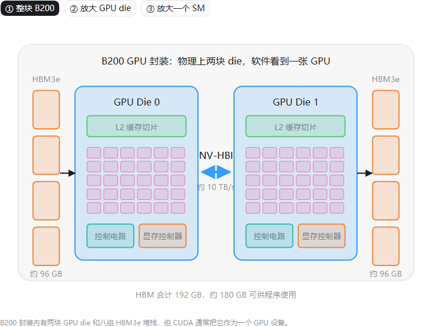
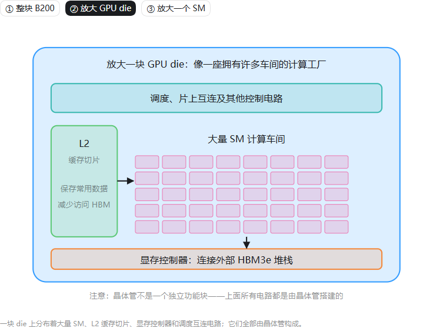
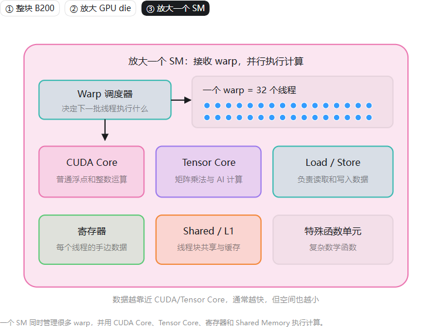

# NVIDIA Blackwell B200 GPU 分层结构图

这是一张面向初学者的交互式教学图，从三个层级解释 Blackwell B200：

1. 整块 B200：两块 GPU die、HBM3e 与 NV-HBI
2. 单块 GPU die：SM、L2 缓存、显存控制器和控制电路
3. 单个 SM：Warp 调度器、CUDA Core、Tensor Core、寄存器与 Shared Memory/L1

## 在线交互版

[打开交互式结构图](https://yeyunu.github.io/b200-gpu-anatomy/)

## 三层结构预览

### 1. 整块 B200

### 2. 放大 GPU die

### 3. 放大一个 SM

## 关键概念

- B200 物理上包含两块 GPU die，但软件通常将其识别为一个 CUDA GPU 设备。
- 两块 die 通过 NV-HBI 高速互连协同工作。
- HBM 容量表示能存放多少数据，HBM 带宽表示每秒能搬运多少数据。
- SM 是 GPU 执行线程和 CUDA kernel 的主要计算单元。
- CUDA Core 负责一般数值运算，Tensor Core 专门加速矩阵乘法和 AI 计算。
- 晶体管不是与 SM、缓存并列的功能模块；这些电路本身都由晶体管构成。

## 说明

本图用于帮助理解硬件组成关系，并非 NVIDIA 官方芯片版图，图中部件的位置和面积不代表真实物理布局。规格数字参考《AI Systems Performance Engineering》第二章，实际产品配置和可用容量可能有所不同。
